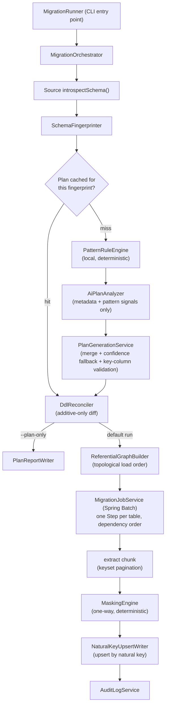

# Universal Data Migration & Masking Tool


A database-agnostic, AI-assisted batch migration engine that copies data between any
supported source and destination database — relational or document-store, same engine or
heterogeneous pair — while irreversibly masking every column that falls under GDPR, HIPAA,
or PCI-DSS, preserving referential integrity across the whole schema, and never touching
existing destination data or structure beyond additive `CREATE`/`ADD COLUMN`.

One Spring Boot deployable. No code change to add a database, add a masking rule, or
migrate a new schema — only configuration.

```
migration.yml  --(source + destination connection details)-->  db-migration-masking-ai  --> masked, upserted destination
```

## Why this exists

Moving production data into a lower environment (staging, analytics, a partner's
warehouse, an AI training pipeline) means either hand-rolling a one-off ETL script per
database pair, or shipping PII/PHI/PAN downstream in the clear. This tool is the general
solution: point it at any source and any destination, and it figures out — with an AI-
assisted analysis pass backed by a deterministic pattern-matching safety net, never AI
judgment alone — which columns are sensitive, how to mask them one-way, and how to load
the result without breaking foreign keys or clobbering anything already at the destination.

## Engineering highlights

- **Extensible by configuration, not conditionals.** Every source/destination is a
  `SourceConnector`/`DestinationConnector` Spring bean picked up by a `ConnectorRegistry`
  via a `@ConnectorFor("postgres")` marker — there is no `switch`/`if-else` on database
  type anywhere in orchestration code. Optional behavior (DDL, transactions, FK
  introspection) is split into capability interfaces (`DdlCapable`,
  `TransactionalBatchWrite`, `ReferentialMetadataCapable`) that a connector implements only
  where the underlying engine actually supports it — MongoDB implements neither DDL nor FK
  introspection, and the orchestrator skips those steps via an `instanceof` check instead of
  calling a no-op.
- **Masking correctness is decoupled from load order.** Every masking technique is a pure
  function of `(value, secret key)`. A masked foreign key always equals its masked parent
  primary key regardless of which table's chunk is processed first — composite keys,
  self-referencing FKs, and cross-schema FKs all fall out of this for free, with no special
  casing. Load order still matters, but only so the *destination* doesn't reject a child
  row before its parent exists — never for the masked values themselves to agree. Any
  column feeding a primary/foreign/natural key is restricted at plan-validation time to the
  one injective technique (`HASH_HMAC`); a plan that tries to bucket or synthesize a key
  column fails fast before any row is touched.
- **AI proposes, deterministic rules gate.** The AI pass is schema-metadata and
  pattern-match summaries only (counts and matched-pattern names — never raw values, unless
  an org explicitly opts into a private endpoint under its own data agreement). A local,
  independent `PatternRuleEngine` runs regardless of AI availability, and a column's final
  sensitivity is the **OR** of the two signals — a rule can only push a column *into*
  "sensitive," never pull one out, because a missed PII column is the dangerous failure
  mode and an over-masked non-sensitive column is merely inconvenient. Below a configurable
  confidence threshold, the fallback is the most conservative technique for that column's
  shape, not "leave it unmasked." AI is never on the runtime data path — masking and
  loading are plain deterministic Java, re-run identically forever from a cached plan.
- **Additive-only destination DDL, deliberately.** The reconciler will `CREATE TABLE` or
  `ADD COLUMN` for anything missing; it will never `ALTER`, `DROP`, or rename an existing
  destination object. A type conflict is recorded and the affected table (or just the
  affected column, if it isn't part of a key) is skipped for that run and reported —
  never silently coerced.
- **Resumable by construction, not by special-casing.** Spring Batch chunks each table's
  load, one `Step` per table wired in dependency-graph order, independent branches running
  as parallel flows. A failed step skips only its own transitive dependents; because every
  write is an idempotent upsert-by-natural-key, re-running the same job identity resumes
  from the last committed chunk, and running fresh just reprocesses safely.

## Architecture



The full component table, connector contract, masking-technique-to-regulation mapping,
referential-integrity strategy, AI safety-net policy, and configuration schema are written
up in detail in [`specs/db-migration-design.md`](specs/db-migration-design.md) — produced
from a structured design brief in
[`specs/db-migration-planning.md`](specs/db-migration-planning.md) before any code was
written, so every non-obvious decision (why Spring Batch over a hand-rolled loop, why
capability interfaces, why the control plane is a separate embedded store) has a recorded
rationale rather than being implicit in the code.

## One-way masking techniques

| Technique | Mechanism | Regulatory basis |
|---|---|---|
| `HASH_HMAC` | HMAC-SHA-256 with a versioned secret key | PCI-DSS 3.4 (render PAN unreadable); GDPR pseudonymization |
| `REDACT_FULL` / `REDACT_PARTIAL` | Fixed token, or partial mask (e.g. last 4 of a PAN) | PCI-DSS 3.4 truncation; HIPAA Safe Harbor |
| `GENERALIZE_BUCKET` | Reduce precision (DOB → year, ZIP → first 3 digits) | HIPAA Safe Harbor's specific date/geography rules |
| `SYNTHETIC_SUBSTITUTION` | Deterministic, HMAC-seeded fake-value generation | GDPR anonymization for display-only fields |

Every technique is non-reversible — no vault, no decryption key, no lookup table, not even
accessible internally. Key/PK/FK columns are restricted to `HASH_HMAC`, the only injective
technique, so upserts never silently merge distinct source rows.

## Supported engines

| Engine | Source | Destination | DDL | FK introspection | Notes |
|---|---|---|---|---|---|
| PostgreSQL | ✅ | ✅ | ✅ | ✅ | `INSERT ... ON CONFLICT` upsert |
| MySQL | ✅ | ✅ | ✅ | ✅ | `INSERT ... ON DUPLICATE KEY UPDATE` |
| Oracle | ✅ | ✅ | ✅ | ✅ | `MERGE` upsert |
| SQL Server | ✅ | ✅ | ✅ | ✅ | `MERGE` upsert |
| MongoDB | ✅ | ✅ | — | — | Schema inferred by sampling; additive-by-nature |

Adding an engine is one new `@ConnectorFor` bean plus a YAML native↔canonical type-mapping
resource — see [`src/main/resources/*-type-mapping.yml`](src/main/resources) for the
existing matrices.

## Tech stack

Java 17 · Spring Boot 3.3 (`spring-boot-starter`, `-jdbc`, `-batch`, `-validation`) ·
Spring Batch (chunked, restartable, dependency-ordered load) · HikariCP · Flyway ·
embedded H2 control plane (job repository, plan cache, audit log — swappable to a managed
Postgres via config) · Jackson (YAML/JSON) · JUnit 5 + AssertJ · Testcontainers (Postgres,
MySQL, Oracle, SQL Server, MongoDB) for connector contract tests against real engines.

## Getting started

Requires JDK 17, Maven, and Docker (only for the Testcontainers-backed connector tests).

```bash
mvn clean package        # build
mvn test                 # full test suite, including live-container connector tests
```

Run a plan-only pass (schema/masking plan generated and written for review, no data moved):

```bash
java -jar target/db-migration-masking-ai-*.jar \
  --migration.source.connection.url=jdbc:postgresql://localhost:5432/source_db \
  --migration.destination.connection.url=jdbc:postgresql://localhost:5432/warehouse_db \
  --plan-only
```

Drop `--plan-only` to execute the migration. Full configuration reference — connection
pools, masking overrides, virtual foreign keys, AI provider selection, FK-cycle
strategies — is in [`src/main/resources/application.yml`](src/main/resources/application.yml)
and §9 of the design doc.

## Testing strategy

- **Unit tests per masking technique** — determinism (same input + key → same output),
  one-wayness, format/length compliance.
- **Connector contract tests against real engines via Testcontainers** — introspection
  accuracy, additive-only DDL (a pre-seeded conflicting-column fixture asserts no
  alteration occurs), and upsert idempotency (the same batch applied twice yields the same
  destination state).
- **Referential-integrity tests** covering composite keys and self-referencing FKs, asserting
  masked child FK values equal masked parent PK values.
- **Plan-generation tests** covering the AI/pattern-rule merge, confidence fallback, and
  key-column technique validation.

Run `mvn test` with Docker available to exercise the full suite, including the
Testcontainers-backed `PostgresConnectorIntegrationTest`, which spins up a real
`postgres:16-alpine` container and validates the connector end to end.

## Project structure

```
src/main/java/com/migration/
  connector/        SourceConnector/DestinationConnector + one package per engine
    api/             connector contracts, TypeMapper
    jdbc/            shared JDBC scaffolding: introspection, DDL reconciler, upsert writer
    postgres/ mysql/ oracle/ sqlserver/ mongodb/
    registry/        ConnectorRegistry (@ConnectorFor discovery)
  plan/              schema fingerprinting, plan generation, AI provider abstraction
  masking/           one-way masking techniques + key-column validation
  referential/       FK dependency graph, topological load order, cycle handling
  batch/             Spring Batch step/job wiring (extract -> mask -> upsert)
  orchestrator/      MigrationOrchestrator: drives default and --plan-only runs
  config/            @ConfigurationProperties model (MigrationConfig and its tree)
  audit/             append-only audit log for compliance evidence
  report/            --plan-only human/machine-readable report writer
specs/               design brief + resulting design document (read this first)
```

## Design process

This project was built spec-first: [`specs/db-migration-planning.md`](specs/db-migration-planning.md)
is the design brief (functional requirements, constraints, and the deliverables the design
had to produce), and [`specs/db-migration-design.md`](specs/db-migration-design.md) is the
resulting architecture document — assumptions made explicit, every component's
responsibility and interface specified, and a dependency-ordered implementation task list —
before any implementation code was written. The goal was a design a separate engineer (or
session) could build against without re-deriving decisions, which is also why the rationale
above cites specific sections of it rather than restating them.

## License

[MIT](LICENSE)
